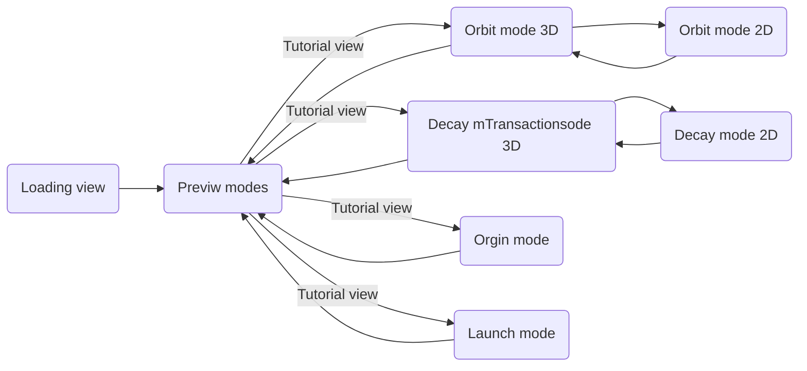

# The flow

## The main views

Page for transition (with tutorial) between modes should be its own component

   1. Loading view
   2. Preview modes (choose mode here, loop back to chagne mode)
   3. Orbit (2D + 3D)
   4. Decay (2D + 3D)
   5. Orgin (2D)
   6. Launch (2D)
   
### Naviagation

## UI features we need
   1. 3D globe and 2D map (same feature?)
   2. Position bubble (if to much data, be able too zoom and the bubble becomes more detailed)
      1. Number
      2. Color
      3. Size
   3. Mode button
      1. Route back to preview
   4. Time line bar
      1. start and end button
      2. years 
   5. filtering box
      1. radio button
      2. check-box
      3. drop-down?
      4. sliders ?
   6. Orbits 
      1. Higlight it
      2. Clickable
      3. (back button if we click the orbit ?)
   7. Information "(i) pop-up" for attributes in the filter
   8. Loading and tutorial pages
      1. cross-button for closing 
      2. (BONUS make it interactive)
   9.  Preview table
      3. clickle and route to mode page
   10. 3D/2D button
       1.  Route to respective map
   11. Color for denisty of debris
   12. Information box 
       1.  heat map inoformation about a specific country/lounch place

